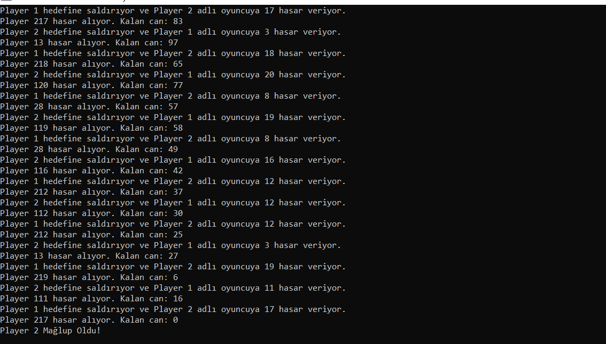

# Basit Savaş Simülasyonu
Bu C++ programı, iki oyuncu arasında basit bir savaş simülasyonunu gerçekleştirir. Her oyuncu bir `Player` sınıfı nesnesini temsil eder ve birbirlerine rastgele hasarlar verirler.

# `Player` Sınıfı
- `Player` sınıfı, bir oyuncuyu temsil eder ve isim ile sağlık özelliklerine sahiptir.
- `attack` fonksiyonu, hedef oyuncuya rastgele bir hasar verir ve takeDamage fonksiyonunu çağırır.
- `takeDamage` fonksiyonu, oyuncunun sağlığını düşürür ve sağlığı 0'ın altına düşerse oyuncunun mağlup olduğunu bildirir.
- `getName` fonksiyonu, oyuncunun ismini döndürür.
- `isAlive` fonksiyonu, oyuncunun sağlığının 0'dan büyük olup olmadığını kontrol eder.

# `main` Fonksiyonu
- `main` fonksiyonu, iki oyuncu nesnesi oluşturur (`player1` ve `player2`).
- Rastgele sayı üretimi için `std::srand(std::time(0));` kullanılır.
- Birinci oyuncu (`player1`) ve ikinci oyuncu (`player2`) sırayla birbirlerine saldırır.
- Savaş, bir oyuncunun sağlığı 0'a düşene kadar devam eder.

  # Örnek Kullanım
  - `main` fonksiyonu içinde iki oyuncu nesnesi oluşturulur.
  -  Oyuncular birbirlerine sırayla saldırırlar ve her saldırı sonrasında durum ekrana yazdırılır.
  -  Savaş, bir oyuncu mağlup olana kadar devam eder.

    **Bu örnek, basit bir savaş simülasyonunu gerçekleştirir ve sınıf yapısının kullanımını gösterir.**
  
# Ekran Resmi

# Bilgilendirme
**---------------------------------------------------------**
| Herkese Açık | Geliştirilebilir | Zyra Software|
|---------|---------|---------|
| Açık | Geliştirilebilir |@zyrasoftware |
